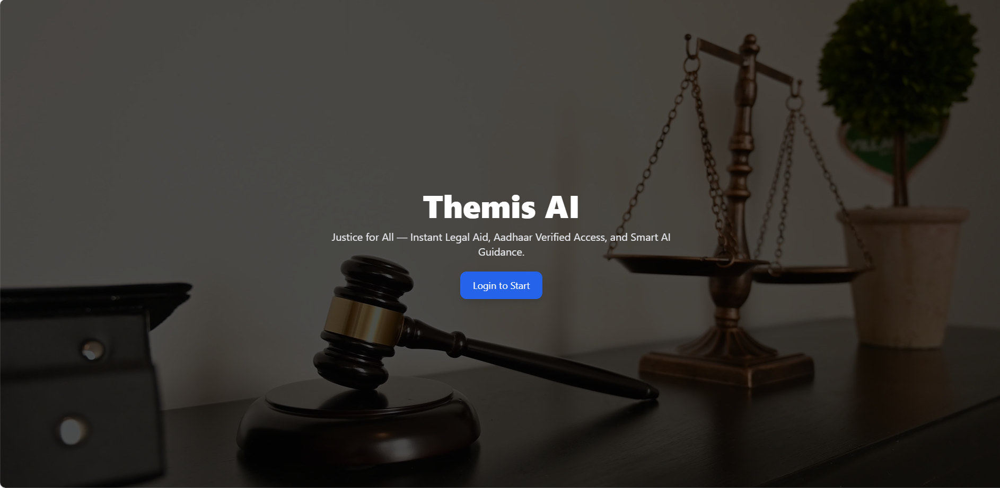
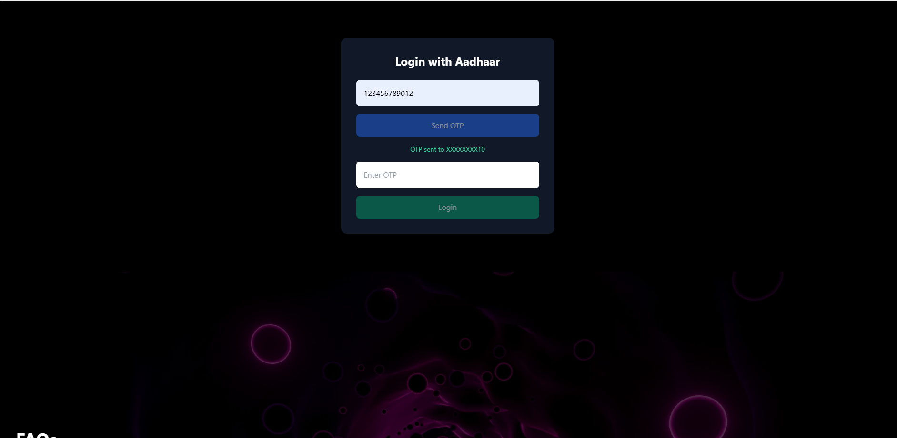
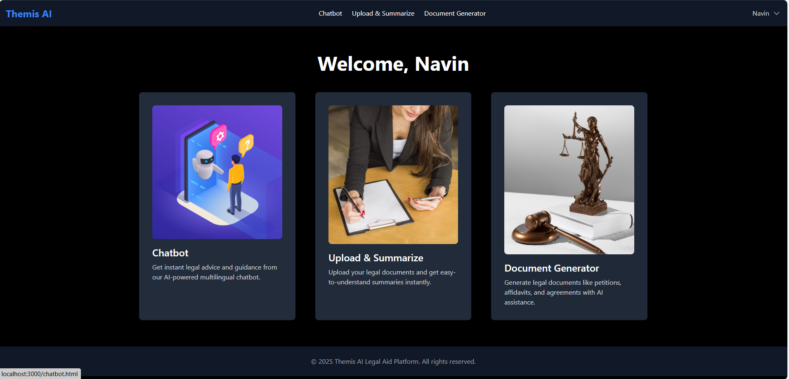
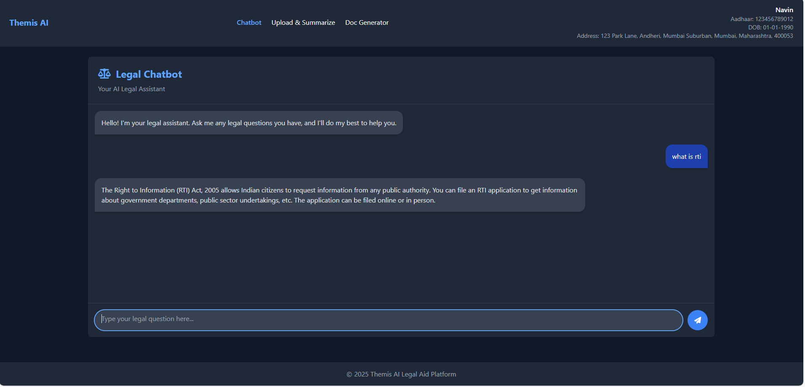
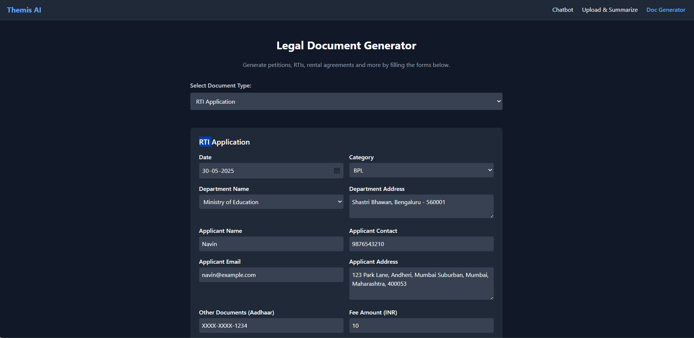
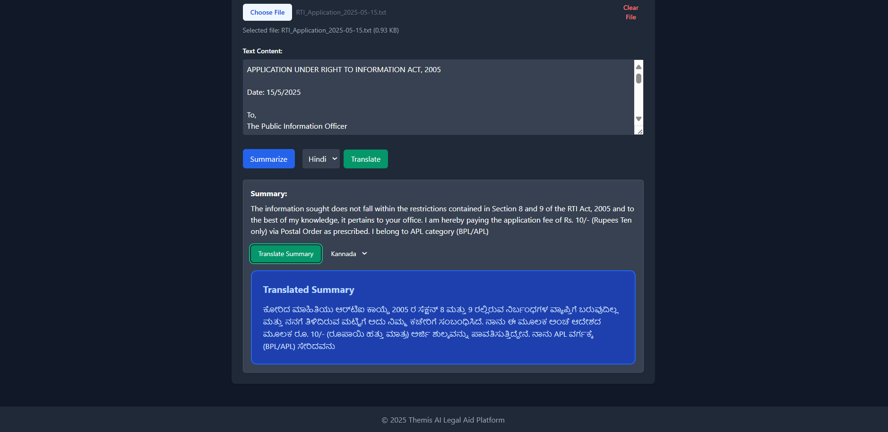
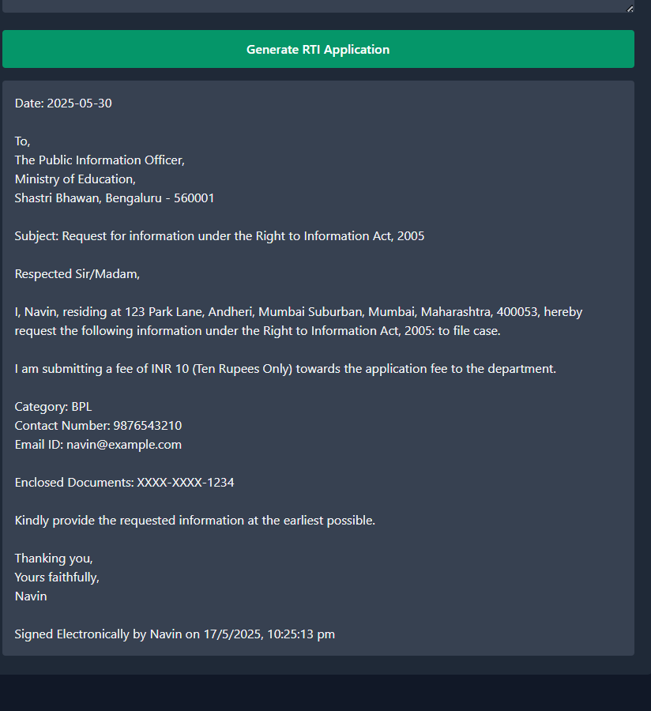

# AI Legal Aid Platform

A powerful, AI-driven legal assistance platform that integrates a chatbot interface and LLaMA-based document analysis to streamline legal research, simplify form generation, and provide multilingual support.

## Project Structure

```
ai-legal-aid-platform/
│
├── client/                   # Frontend application
├── server/                   # Backend server
├── llama_service/           # LLaMA inference service
│   ├── main.py              # FastAPI service for LLaMA
│   └── requirements.txt     # Python dependencies
│
└── data/                    # Data directory
    └── legal-docs/          # Legal document text files
```

## Setup Instructions

### 1. Backend Setup

```bash
cd server
npm install
```

### 2. LLaMA Service Setup

```bash
cd llama_service
pip install -r requirements.txt
```

You'll need to download the LLaMA model file and place it in the `data` directory. The default expected path is `data/llama-2-7b-chat.Q4_K_M.gguf`.

### 3. Frontend Setup

```bash
cd client
npm install
```

## Running the Application

1. Start the backend server:
```bash
cd server
npm start
```

2. Start the LLaMA service:
```bash
cd llama_service
uvicorn main:app --reload
```

3. Start the frontend development server:
```bash
cd client
npm start
```

## Features

- AI Legal Chatbot — Interact with legal documents and questions through an intelligent chatbot powered by LLaMA.
- Document Automation — Instantly generate Right to Information (RTI) forms and rent agreements based on user input.
- Smart Summarization — Upload legal texts and receive concise summaries with optional translation to Hindi and Kannada.


## API Endpoints

### Backend Server
- `GET /`: Server status
- `POST /api/chat`: Send a message to the chatbot

### LLaMA Service
- `GET /`: Service status
- `POST /api/llama`: Send a question to the LLaMA model
### Screenshots
<p align="center">    </p> <p align="center">     </p>
<p align="center"></p>

##  Contributing

Thank you for considering contributing to AI Legal Aid Platform!

To get started:
1. Fork the repo
2. Create a feature branch
3. Submit a pull request

## License

MIT License

Copyright (c) 2025 Nishta N Shetty

Permission is hereby granted, free of charge, to any person obtaining a copy
of this software and associated documentation files (the "Software"), to deal
in the Software without restriction, including without limitation the rights
to use, copy, modify, merge, publish, distribute, sublicense, and/or sell
copies of the Software, and to permit persons to whom the Software is
furnished to do so, subject to the following conditions...

[full MIT license text here or link]
